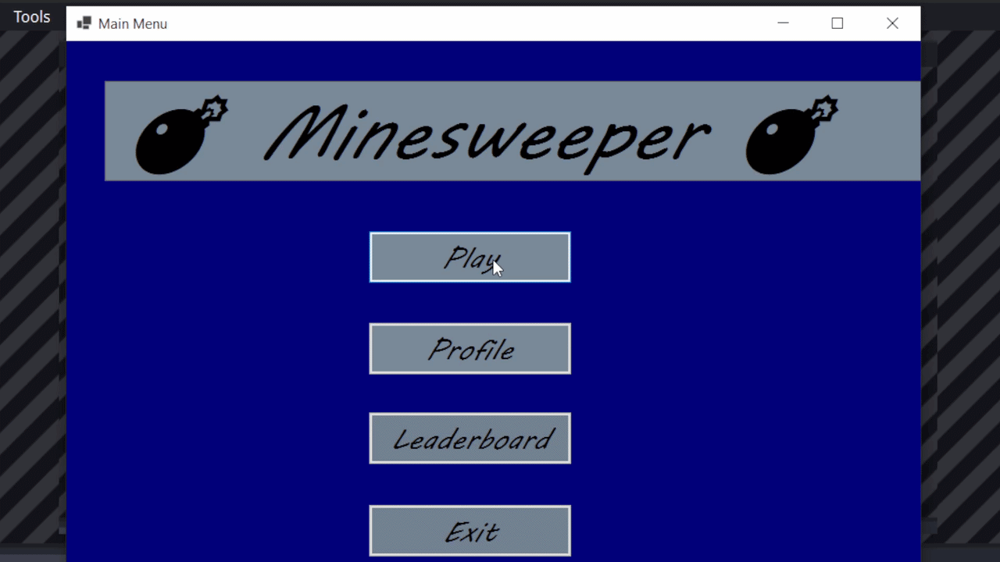

# Minesweeper

It is a small project of mine that I did on my internship at company Programista in Plovdiv, Bulgaria. The Minesweeper includes an online database made with Firebase, 5 different difficulties + a custom difficulty. 

## Preview

## Layer Breakdown

### Business Layer

In this layer we define our model classes and what kind of data are they keeping. In this layer we hold the data for:
- Player
- Game
- Difficulty settings

### Data Layer

In this layer we create the CRUD (Create, Read, Update, Delete) methods for our database for every class in the model we have. It also holds the information about the connection to the database. 

### Service Layer

This layer holds the logic of our game. How the bombs are spawned, marked or exploded. It manages also the connection between the view and the model of the Minesweeper.

### Presentation Layer

This the presenter of the game. 

